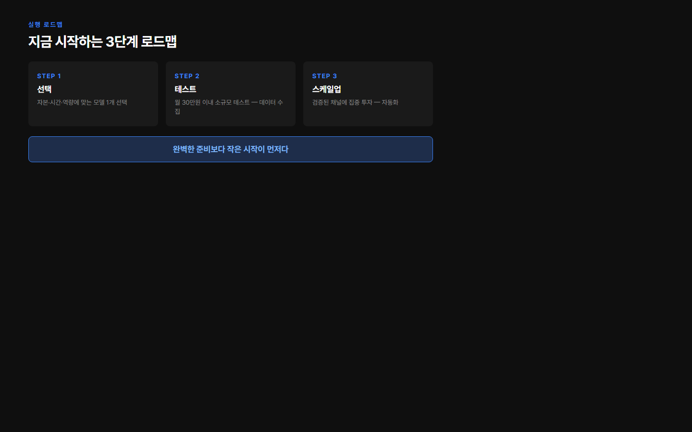

# PPT Team Agent

Claude Code Sub-Agent + Skill 아키텍처로 "설득력 있는" 프레젠테이션을 자동 생성하는 도구입니다.
HTML로 슬라이드를 만든 뒤 PPTX로 변환하며, 설득 규칙을 자동으로 강제·검증합니다.

- **Stack**: Node.js · Playwright(HTML→이미지) · pptxgenjs(PPTX 생성) · sharp · Claude Code Sub-Agent/Skill

> 같은 프로젝트의 더 확장된 버전으로 [`ppt-agent`](https://github.com/mnunu123/ppt-agent)가 있습니다
> (R0~R7 검증 규칙 전체, `pipeline.js`를 통한 리서치·영상 통합 자동화 등 추가 기능 포함).
> 이 저장소는 핵심 CLI 파이프라인(`build_deck.js`)과 Sub-Agent 구성에 집중된 스냅샷입니다.

## 실제 구동 화면 (이미 생성된 결과물)

이 저장소에는 실제로 실행해서 나온 결과물이 `output/`, `out/`에 이미 커밋되어 있습니다 —
별도 실행 없이도 아래는 그 실제 산출물을 그대로 캡처한 화면입니다.


*`output/slides/slide-01.html` — "이커머스 트렌드 & 수익화 전략" 주제로 실제 생성된 표지 슬라이드.*


*`output/slides/slide-12.html` — 마지막 슬라이드, 3단계 실행 로드맵 + CTA.*

이 실행에서 나온 나머지 산출물도 저장소에 그대로 남아있습니다:

- `output/research.md`, `research-findings.md`, `research-result.md` — research-agent 결과
- `output/slide-outline.md`, `slides-spec.md` — organizer-agent 결과
- `output/critique.md` — critic-agent가 잡아낸 규칙 위반 및 수정 지시
- `output/slides/slide-01~12.html` — design-skill이 생성한 HTML 슬라이드 12장
- `output/assets/cover-video.mp4`, `cover-audio.mp3` — 표지에 삽입된 실제 미디어
- `out/*-storyboard.md`, `*-validation.md`, `*-copy-report.md` — `samples/` 예제 4건(policy_youth_rent, semis_rally 등)을 `build_deck.js`로 돌린 검증/카피 리포트

## 사용 방법 2가지

### 1) CLI 파이프라인 — `build_deck.js`

```bash
node scripts/build_deck.js --in samples/policy_youth_rent.json --out out/policy_youth_rent.pptx
node scripts/build_deck.js --in samples/semis_rally.json       --out out/semis_rally.pptx
```

주제가 무엇이든 "남을 설득하는 PPT 흐름"으로 자동 생성하고 규칙 위반을 자동 검수합니다.
명령 1개로 PPTX·HTML 슬라이드·스토리보드·검증 리포트·카피 리포트 5가지가 나옵니다.

**입력 JSON 스키마**

```json
{
  "audience":   "누구를 설득?",
  "goal":       "끝나고 무엇을 하게?",
  "topic":      "주제",
  "key_points": ["핵심 주장 / 근거 / 절차"],
  "evidence": [{ "type": "stat|quote|case|rule", "text": "...", "source": "..." }],
  "cta":       ["다음 행동 3개"],
  "constraints": { "slide_count": 10, "title_len": "16~22", "no_paragraph": true }
}
```

동영상 커버가 필요하면 `assets/`에 `.mp4`를 넣어두면 첫 슬라이드에 자동 임베딩됩니다
(`output/assets/cover-video.mp4`가 실제 적용된 예시입니다. Python 3 필요, `assets/README.md` 참고).

### 2) Claude Code Sub-Agent 파이프라인 (`.claude/`)

리서치 → 슬라이드 설계 → 품질 검수를 서로 다른 에이전트/스킬로 분리해 실행하는 구조입니다.
`output/` 안의 실제 산출물이 바로 이 파이프라인을 한 번 완주한 결과입니다.

```
research-agent   → output/research.md 생성 (리서치·근거 수집만, 슬라이드 판단 금지)
organizer-agent  → slide-outline.md + slides-spec.md 생성
critic-agent     → 위반 검사 → 통과 시 "ALL PASS", 위반 시 critique.md로 재작성 요청
design-skill     → slides-spec.md → output/slides/*.html
asset-skill      → 인포그래픽 이미지 I/O 스펙 (스펙 정의만, 구현 보류)
pptx-skill       → output/slides/*.html → PPTX (16:9 고정, run.cjs로 실행)
```

## 설치

```bash
npm install
```

## 디렉터리 구조

```
.claude/
  agents/                 research-agent / organizer-agent / critic-agent 정의
  skills/
    pptx-skill/            HTML → PPTX 변환
    design-skill/           slides-spec.md → HTML 생성 규칙
    asset-skill/            인포그래픽 자산 I/O 스펙 (구현 보류)
scripts/
  build_deck.js            CLI 진입점
  planner.js                설득 흐름 선택
  slide_writer.js            제목=결론 + 줄글 금지 적용
  copywriter.js               제목 후보 생성 + 소유권 검증
  validator.js                규칙 검증
  exporter.js                 HTML 생성 + PPTX 변환 + 리포트
  themes/bpt_premium.js        BPT_PREMIUM 테마 HTML 생성기
samples/                    입력 예제 JSON
assets/                     커버 영상(.mp4) 배치 위치
out/, output/                실행 결과물 (이미 커밋된 실제 실행 예시 포함)
```

## 라이선스

MIT License
